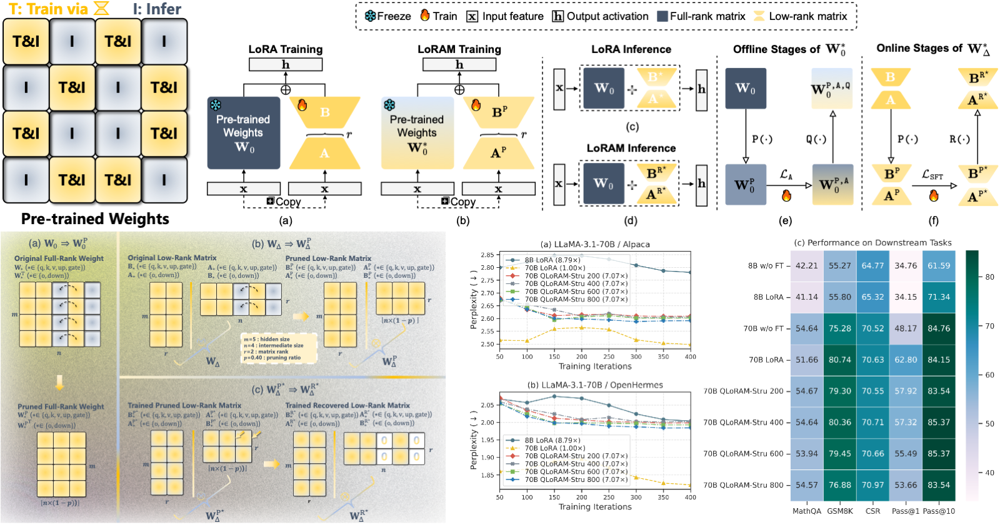

<div align="center">
<h1>
      
    <br>  
    <em>Train Small, Infer Large</em>  
    <br>  
    Memory-Efficient LoRA Training for LLMs
</h1>


<h2 style="color: #6a5acd; font-weight: bold;">
🚀 15.81×～16.95× Parameter Reduction ⬇️
</h2>
LoRAM is a memory-efficient LoRA training method for cost-effective performance gains by <br> training low-rank matrices on a pruned model and merging them for inference on the original model.

<b><a href="https://github.com/junzhang-zj">Jun Zhang</a></b><sup>1</sup>,
<b><a href="https://github.com/LorrinWWW">Jue Wang</a></b><sup>1</sup>,
<b><a href="https://github.com/longaspire">Huan Li</a></b><sup>1</sup>,
<b><a href="">Lidan Shou</a></b><sup>1</sup>,
<b><a href="">Ke Chen</a></b><sup>1</sup>,
<b><a href=""><br>Yang You</a></b><sup>2</sup>,
<b><a href="">Guiming Xie</a></b><sup>3</sup>,
<b><a href="">Xuejian Gong</a></b><sup>3</sup>,
<b><a href="">Kunlong Zhou</a></b><sup>3</sup>

<sup>1</sup> Zhejiang University,   <sup>2</sup> National University of Singapore, <sup>3</sup> OPPO AI Center  
</div>  

---
## 📌 Overview 
<div align="center">
  
</div>

---

## 🔥 Features  
✅ Train LoRA on a **pruned model** to reduce memory footprint  
✅ Recover LoRA for high-qulity **full model** inference  

---

## 🛠 Installation  

Clone the repository and install dependencies:  
```bash
git clone https://github.com/your-repo/LoRAM.git
cd LoRAM
pip install -r requirements.txt
```

---

## 🙌 Acknowledgments  

### 🤝 Institutional Collaboration  
This project was made possible thanks to a collaboration with:  
<a href="https://www.zju.edu.cn/"></a> &nbsp;&nbsp;&nbsp;
<a href="https://nus.edu.sg/"></a> &nbsp;&nbsp;&nbsp;
<a href="https://www.oppo.com/"></a>  

### 🤝 Tool Contributions  
Shout out to [LLM-Pruner](https://github.com/horseee/LLM-Pruner) and [SparseGPT](https://github.com/IST-DASLab/sparsegpt)! 
<br>LoRAM leverages these tools, and we appreciate their contributions to the research community.


---

## 📖 Citation
If you find the resources in this repository useful, please cite our paper:

```
@inproceedings{
zhang2025train,
title={Train Small, Infer Large: Memory-Efficient Lo{RA} Training for Large Language Models},
author={Jun Zhang and Jue WANG and Huan Li and Lidan Shou and Ke Chen and Yang You and Guiming Xie and Xuejian Gong and Kunlong Zhou},
booktitle={The Thirteenth International Conference on Learning Representations},
year={2025},
url={https://openreview.net/forum?id=s7DkcgpRxL}
}
```
---
